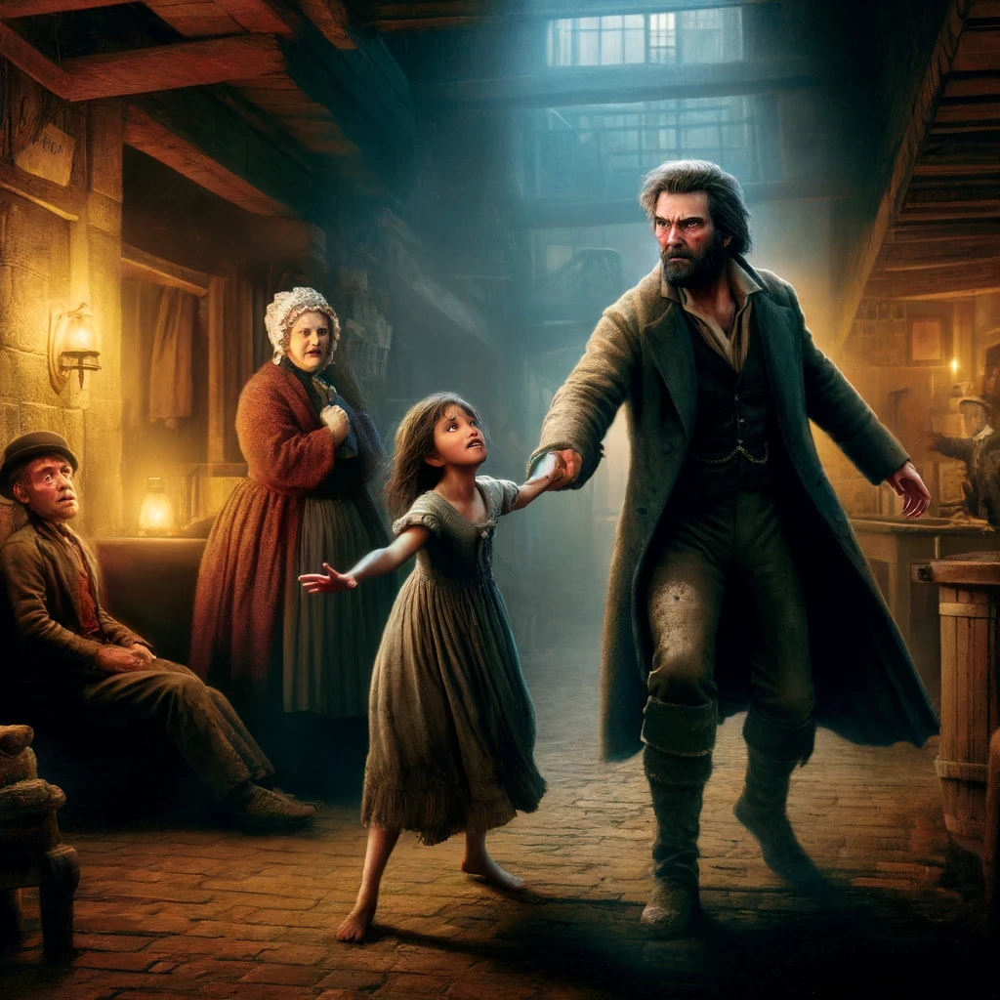

# Les Misérables Language Model (LMLM)

A simple language model trained on Victor Hugo's Les Misérables. The architecture is Transformer-like, and the tokenizer uses Byte Pair Encoding.

Project inspired by Andrej Karpathy [[1,](https://www.youtube.com/watch?v=kCc8FmEb1nY) [ 2](https://www.youtube.com/watch?v=zduSFxRajkE)]